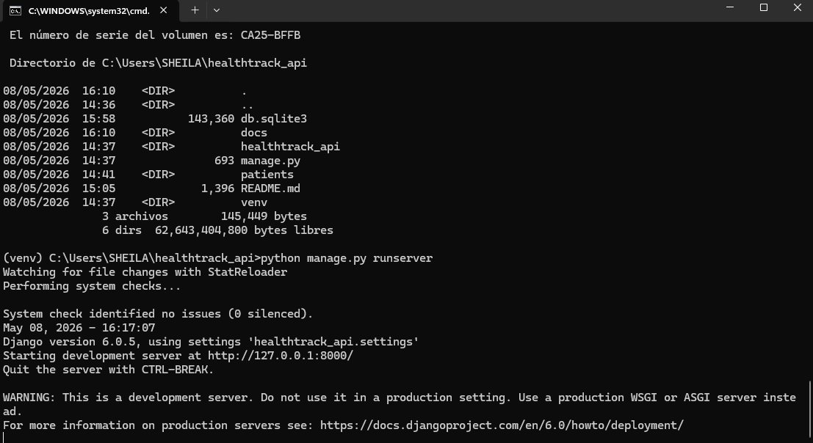
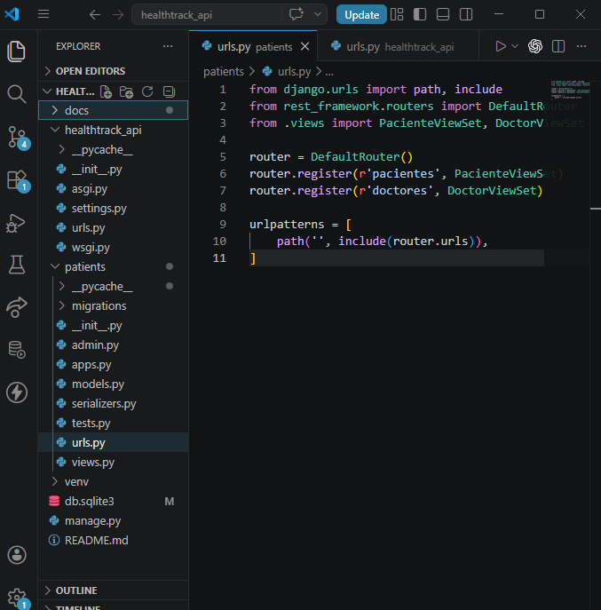
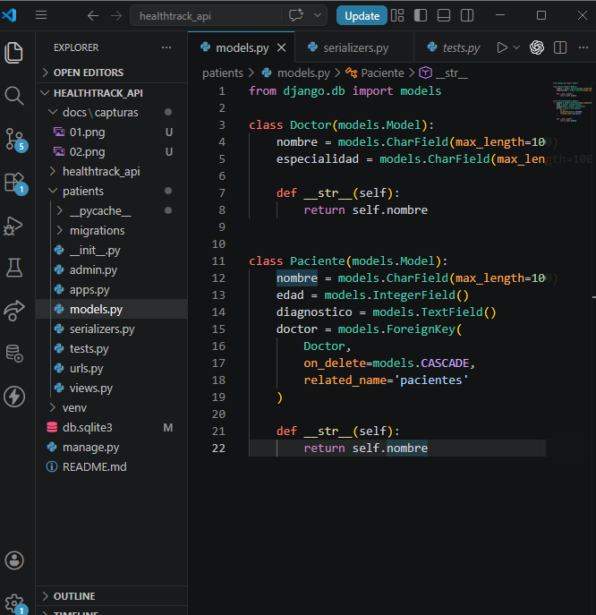
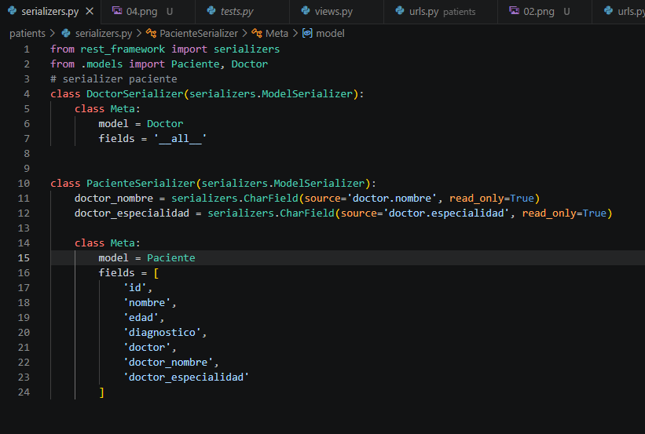
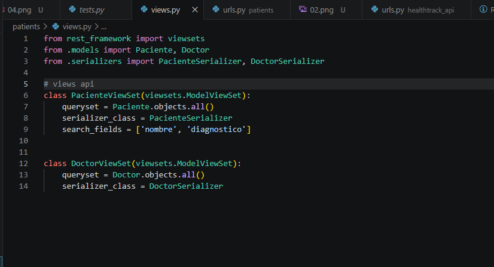
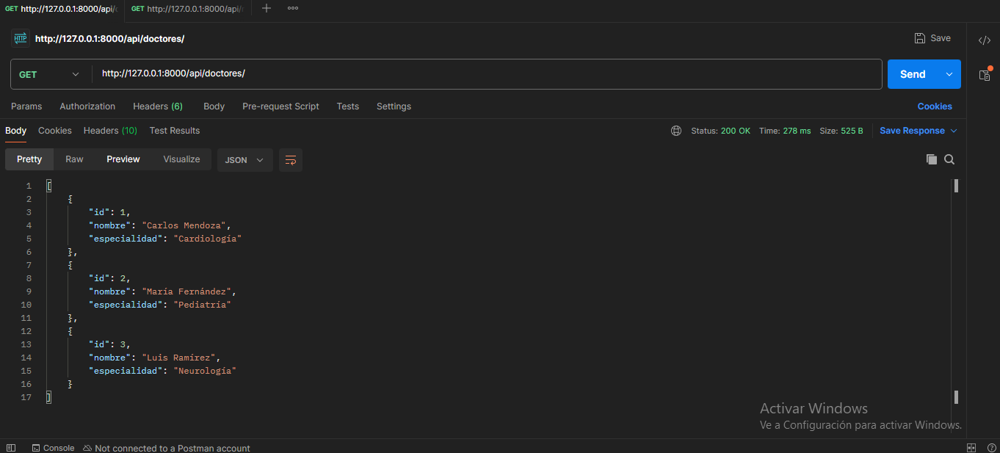
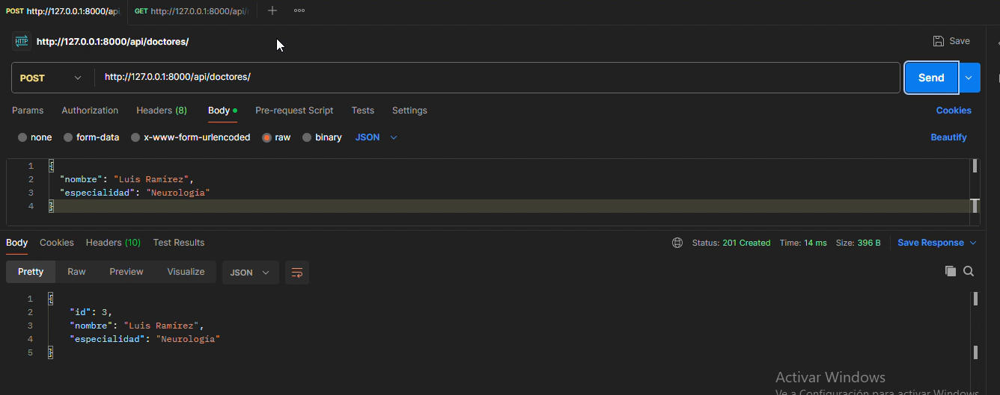
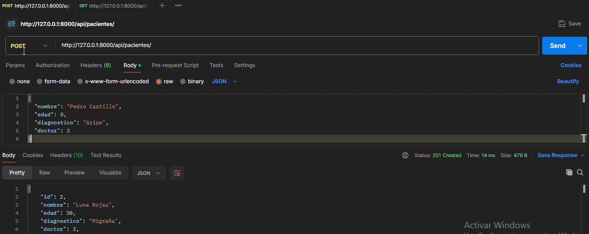
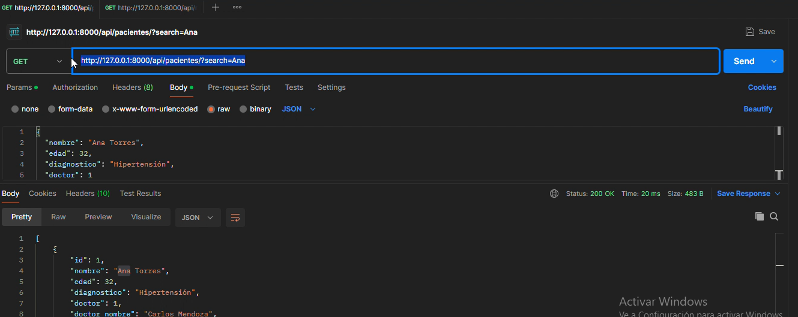
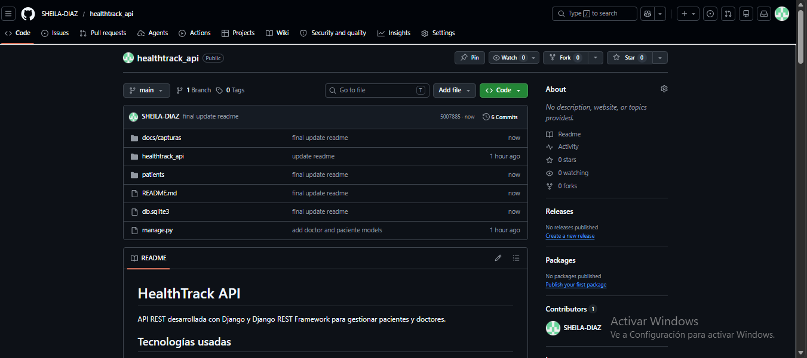

# HealthTrack API

API REST desarrollada con Django y Django REST Framework para gestionar pacientes y doctores.

## Tecnologías usadas

- Python
- Django
- Django REST Framework
- SQLite
- Postman

## Ejecutar servidor

```bash
python manage.py runserver
```

## Endpoints

### Doctores

- GET `http://127.0.0.1:8000/api/doctores/`
- POST `http://127.0.0.1:8000/api/doctores/`
- PUT `http://127.0.0.1:8000/api/doctores/1/`
- DELETE `http://127.0.0.1:8000/api/doctores/1/`

Ejemplo POST Doctor:

```json
{
  "nombre": "Carlos Mendoza",
  "especialidad": "Cardiología"
}
```

### Pacientes

- GET `http://127.0.0.1:8000/api/pacientes/`
- POST `http://127.0.0.1:8000/api/pacientes/`
- PUT `http://127.0.0.1:8000/api/pacientes/1/`
- DELETE `http://127.0.0.1:8000/api/pacientes/1/`

Ejemplo POST Paciente:

```json
{
  "nombre": "Ana Torres",
  "edad": 32,
  "diagnostico": "Hipertensión",
  "doctor": 1
}
```

## Búsqueda

- GET `http://127.0.0.1:8000/api/pacientes/?search=Ana`
- GET `http://127.0.0.1:8000/api/pacientes/?search=Hipertensión`

## Relación entre entidades

Cada paciente está relacionado con un doctor.

La respuesta del endpoint de pacientes muestra:

```json
{
  "doctor_nombre": "Carlos Mendoza",
  "doctor_especialidad": "Cardiología"
}
```

## Capturas del Proyecto

### 01.png → Servidor Django

Descripción:
Servidor Django ejecutándose correctamente con `python manage.py runserver`.



---

### 02.png → Estructura del Proyecto

Descripción:
Estructura general del proyecto en Visual Studio Code.



---

### 03.png → Models

Descripción:
Archivo `models.py` mostrando las entidades Doctor y Paciente.



---

### 04.png → Serializers

Descripción:
Archivo `serializers.py` mostrando los serializers de Doctor y Paciente.



---

### 05.png → Views

Descripción:
Archivo `views.py` mostrando los ViewSets implementados con Django REST Framework.



---

### 06.png → GET Doctores

Descripción:
Prueba del endpoint GET `/api/doctores/` en Postman.



---

### 07.png → POST Doctor

Descripción:
Creación de un doctor mediante endpoint POST.



---

### 08.png → POST Paciente

Descripción:
Registro de un paciente relacionado con un doctor.



---

### 09.png → Search Paciente

Descripción:
Búsqueda de pacientes usando `?search=`.



---

### 10.png → GitHub

Descripción:
Repositorio GitHub del proyecto mostrando commits y README.



## Video YouTube

https://youtu.be/trwP5sHuIwQ

## GitHub

https://github.com/SHEILA-DIAZ/healthtrack_api

## README

https://github.com/SHEILA-DIAZ/healthtrack_api/blob/main/README.md